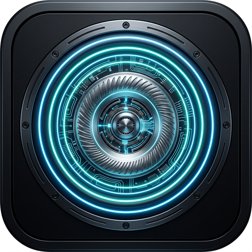
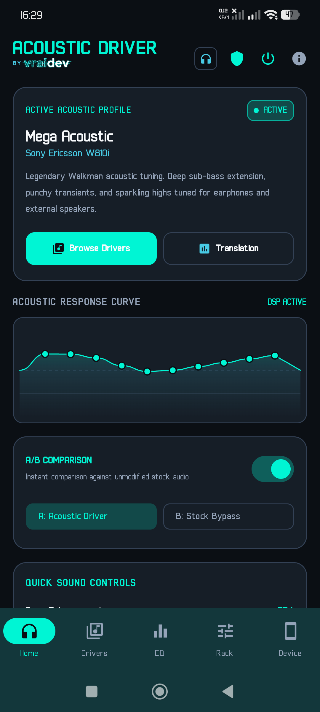
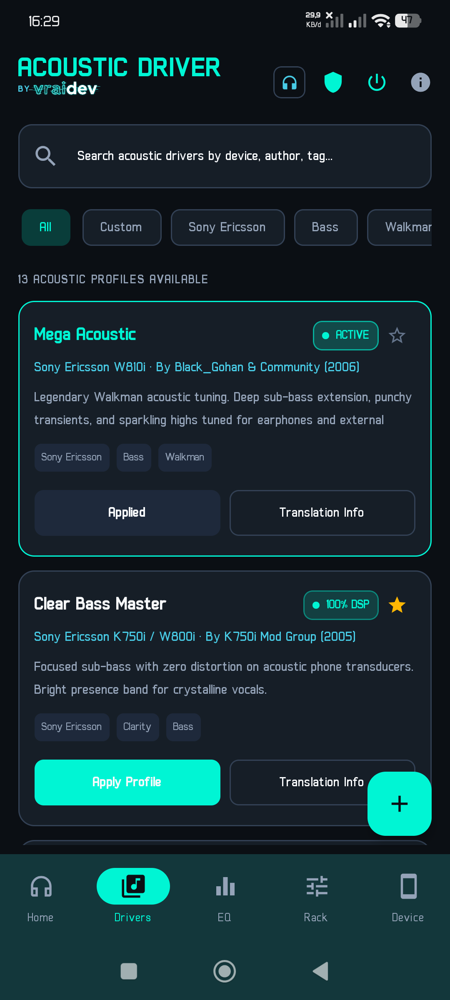
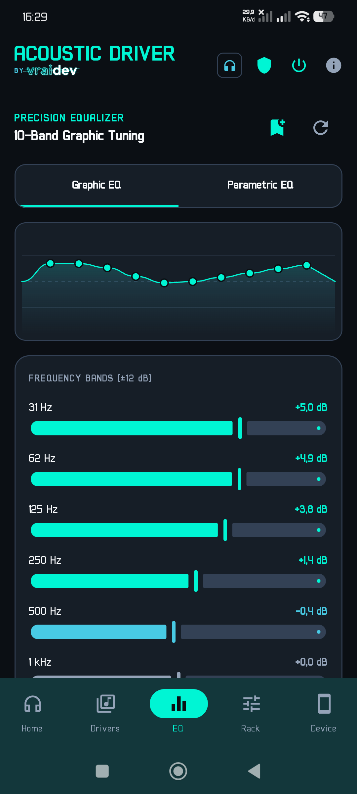
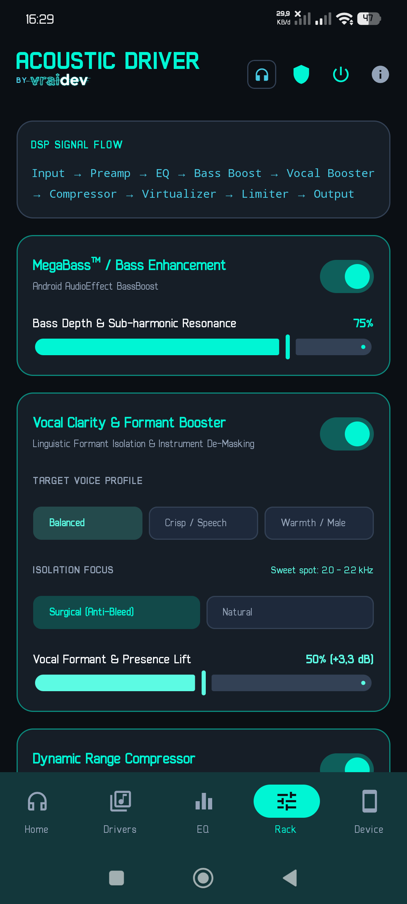
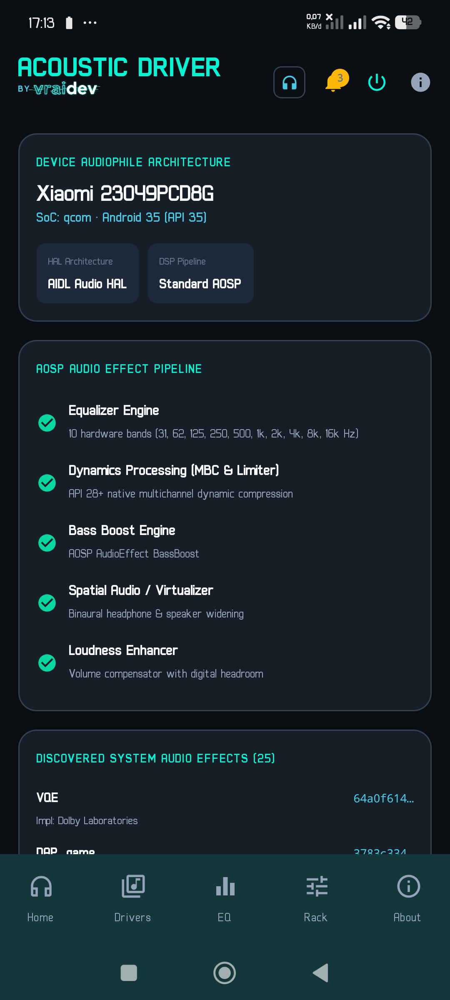
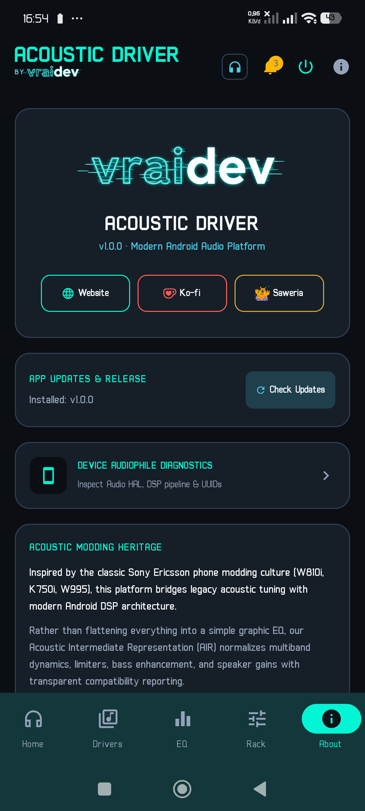

# Acoustic Driver — Android Audio Tuning Platform

<p align="center">
  
</p>

<p align="center">
  <strong>Engineered by <a href="https://vraidev.com">Vrai-Dev</a></strong> • <em><a href="https://vraidev.com">vraidev.com</a></em>
</p>

<p align="center">
  
</p>

<p align="center">
  <a href="release/app-release.apk"></a>
  <a href="https://ko-fi.com/vraidev"></a>
  <a href="https://saweria.co/vraidev"></a>
</p>

<p align="center">
  
  
  
  
  
  
</p>

---

## 📸 Real Device Screenshots

Captured directly from an active Android device (*Xiaomi 23049PCD8G* running Android 14 / HyperOS):

| **Acoustic Home & Audio Curve** | **Acoustic Drivers Catalog** |
| :---: | :---: |
|  |  |
| *Active profile status, A/B testing switch & frequency curve* | *Curated heritage drivers, categories, and custom profile import* |

| **10-Band Graphic Tuning** | **Effects Rack & Vocal Clarity** |
| :---: | :---: |
|  |  |
| *±12 dB precision faders (31Hz–16kHz) with live frequency plot* | *MegaBass™, Surgical Vocal Clarity Booster & Dynamic Limiter* |

| **Device Audiophile Diagnostics** | **About, Real Icons & Updates** |
| :---: | :---: |
|  |  |
| *Audio HAL, DSP pipeline & system effects audit* | *Vrai-Dev branding, real Ko-fi/Saweria icons, in-app update checker & diagnostics link* |

---

## 1. Overview

**Acoustic Driver** is an open-source Android audio tuning platform and legacy acoustic profile manager inspired by the legendary Sony Ericsson acoustic modding scene (W810i, K750i, W995, etc.).

Rather than treating acoustic profiles as simple graphic equalizer presets, **Acoustic Driver** bridges the gap between classic hardware tuning files and modern Android audio processing:

- 🎚️ **No Root Required**: Operates completely in user space using Android 9+ `DynamicsProcessing` and hardware-accelerated `AudioEffect` session chains.
- 📜 **Legacy Parser**: Ingests original Sony Ericsson `.ini`, text, XML, and parameter dumps.
- 🎧 **Acoustic Intermediate Representation (AIR)**: Normalizes multi-band dynamics, limiters, bass enhancement, speaker gains, and parametric curves.
- 🔬 **Transparent Compatibility Analysis**: Explicitly scores and reports what is handled natively vs. approximated in software (`NATIVE`, `APPROXIMATED`, `PARTIAL`, `UNSUPPORTED`).
- ⚡ **Precision Vocal Clarity & Formant Booster**: Frequency-targeted vocal enhancement engine with adjustable surgical focus (Sharp, Balanced, Broad) and custom vocal profile presets (Podcast/Broadcast, Airy Lead, Warm Male, Crisp Female).

---

## 2. Core Architecture

```
┌──────────────────────────────────────────────────────────────┐
│                    Acoustic Driver App                       │
├──────────────────────────────────────────────────────────────┤
│ Jetpack Compose UI (Material 3 • Dark Audiophile Theme)      │
│  ├─ Home (Active Profile • Spectrum Curve • A/B Switch)      │
│  ├─ Drivers Browser (Search • Categories • Translation Info) │
│  ├─ Equalizer (10-Band Graphic • Parametric Multi-Filter)    │
│  ├─ Effects Rack (MegaBass • Vocal Clarity • Comp • Limiter) │
│  ├─ Device Diagnostics (Audio HAL • Effect UUIDs)            │
│  └─ About (Vrai-Dev Showcase • vraidev.com)                  │
├──────────────────────────────────────────────────────────────┤
│ Acoustic Driver Manager                                      │
│  ├─ Legacy Sony Ericsson Parser (.ini, XML, Hex dumps)       │
│  ├─ JSON AIR Parser (Modern interchange format)              │
│  ├─ AIR Normalizer                                           │
│  ├─ Parameter Compatibility Analyzer                         │
│  └─ Acoustic Translator                                      │
├──────────────────────────────────────────────────────────────┤
│ Audio Backend                                                │
│  ├─ DynamicsProcessing (Multiband 10-Band Pre-EQ & Limiter)  │
│  ├─ Equalizer (Fallback hardware band mapping)               │
│  ├─ BassBoost (MegaBass™ low-end contouring)                 │
│  ├─ Vocal Clarity Engine (Surgical bell filters 1kHz–4kHz)   │
│  ├─ Virtualizer (3D spatial soundstage)                      │
│  └─ LoudnessEnhancer (Headroom & digital gain)               │
├──────────────────────────────────────────────────────────────┤
│ Driver Catalog                                               │
│  ├─ Bundled Heritage Catalog (W810i, K750i, W995, etc.)      │
│  ├─ Local Repository & User Import Engine                    │
│  └─ Output Profile Manager (Speaker, Headset, USB, Bluetooth)│
└──────────────────────────────────────────────────────────────┘
```

---

## 3. Key Features

### 🎧 Acoustic Intermediate Representation (AIR)
Acoustic drivers are represented as independent domain models before translation:
```kotlin
data class AcousticIntermediateRepresentation(
    val metadata: DriverMetadata,
    val preampDb: Float = 0.0f,
    val masterGainDb: Float = 0.0f,
    val graphicEq: List<EqBand> = emptyList(),
    val parametricEq: List<ParametricFilter> = emptyList(),
    val bassBoost: BassConfig? = null,
    val vocalBooster: VocalBoosterConfig? = null,
    val compressor: CompressorConfig? = null,
    val limiter: LimiterConfig? = null,
    val stereoSpatial: SpatialConfig? = null,
    val rawLegacyParameters: Map<String, String> = emptyMap()
)
```

### 🔬 Transparent Compatibility Scoring
Every imported profile is analyzed against the target device's active capabilities:
- **Native**: Directly supported by hardware or DSP (e.g. Android `Equalizer`, `DynamicsProcessing`).
- **Approximated**: Translated with software heuristics (e.g., legacy hardware amplifier gain converted into safe digital preamp headroom).
- **Unsupported / Sandboxed**: Proprietary ASIC registers that cannot run without device-specific vendor firmware.

### 🎚️ 10-Band Full-Spectrum Graphic & Parametric Equalizer
- **10-Band Graphic Mode**: 31Hz, 62Hz, 125Hz, 250Hz, 500Hz, 1kHz, 2kHz, 4kHz, 8kHz, 16kHz powered by Android 9+ `DynamicsProcessing` Pre-EQ with ±12 dB precision faders.
- **Octave Interpolation Engine**: Automatically calculates smooth octave-linear logarithmic curves across all 10 bands for legacy 5-band, 6-band, and 7-band acoustic driver presets.
- **Parametric Mode**: Low-shelf sub-bass filter, peaking mid filter with Q factor bandwidth control, and high-shelf air/treble filter.
- **Custom Profile Management**: Create and save user profiles with custom names, filter instantly via the "Custom" category chip, and manage/delete with one tap.

### ⚡ Complete DSP Audio Effects Rack
Full signal flow rack with independent toggles:
$$\text{Input} \longrightarrow \text{Preamp} \longrightarrow \text{Graphic EQ} \longrightarrow \text{MegaBass} \longrightarrow \text{Vocal Clarity} \longrightarrow \text{Compressor} \longrightarrow \text{Virtualizer} \longrightarrow \text{Limiter} \longrightarrow \text{Output}$$

- **MegaBass™ Bass Enhancement**: Depth control with clipping prevention.
- **Vocal Clarity & Formant Booster**: Surgical speech intelligibility and midrange formant lift (1kHz to 4kHz) with narrow bell isolation, selectable target profiles, and adjustable surgical focus.
- **Dynamic Range Compressor**: Threshold (-30 dB to 0 dB), compression ratio (1:1 to 10:1), attack & release.
- **3D Spatial Virtualizer**: Expansive stereo widening for headphones and external speakers.
- **Peak Limiter**: Configurable digital ceiling safeguard (-6 dBFS to 0 dBFS).

### 🎧 Real-Time Hardware Output Auto-Detection
- Automatically monitors audio routing via `AudioDeviceCallback` and `ACTION_HEADSET_PLUG`.
- Instantly updates the TopBar indicator between **Phone Speaker**, **Wired Headset**, **USB DAC**, and **Bluetooth**.

### 🔄 Real-Time A/B Testing
Instant toggle between active acoustic profile and unadulterated stock audio, complete with volume compensation to avoid loudness bias.

### 📱 Device Audiophile Diagnostics
- Scans audio effects registered in the system via `AudioEffect.queryEffects()`.
- Identifies Audio HAL architecture (AIDL Audio HAL on Android 14+, HIDL on older versions).
- Audits system-wide DSP pipeline, supported hardware equalizer bands, and effect UUIDs.

---

## 4. Curated Bundled Drivers

| Driver Profile | Heritage Device / Origin | Description | Compatibility |
| :--- | :--- | :--- | :--- |
| **Mega Acoustic** | Sony Ericsson W810i | Legendary Walkman acoustic tuning. Deep sub-bass, punchy transients, sparkling highs. | **92% Native** |
| **Clear Bass Master** | Sony Ericsson K750i / W800i | Precision sub-bass with zero distortion, crystalline vocal presence. | **88% Native** |
| **Walkman Soundstage X** | Sony Ericsson W995 | Expansive 3D stereo widening, gentle warmth curve, high-headroom limiter. | **94% Native** |
| **ToSha 5.2 MegaBass** | SE Mod Scene (ToSha) | Famous community driver mod. Massive analog sub-bass boost with warm, relaxed mids. | **90% Native** |
| **Kryak Black Edition** | SE Mod Scene (Kryak) | Aggressive high-output soundstage designed for maximum punch and loudness. | **89% Native** |
| **Peter's Acoustic Evolution**| SE Mod Scene (Peter) | Audiophile-balanced frequency response with pristine harmonic clarity. | **96% Native** |
| **Cyber-shot Extreme** | Sony Ericsson K800i / K850i | Crisp acoustic reproduction with enhanced high-frequency detail and quick transient response. | **90% Native** |
| **BlackShark Acoustic Mod** | SE Mod Scene (BlackShark)| Basshead profile featuring punchy 62Hz/125Hz thump and recessed mid-range. | **88% Native** |
| **Acoustic Pro Live Stage** | SE Mod Scene (Gamer/Live)| Extended stereo virtualizer and elevated upper-mids for open-air concert ambience. | **95% Native** |
| **Xperia ClearAudio+** | Sony Xperia Heritage | Modern Sony Mobile acoustic heritage featuring dynamic bass compression and high-end sparkle. | **98% Native** |
| **Audiophile Linear Reference**| Studio Reference Monitor | Flat, neutral frequency response calibrated for critical listening and USB DACs. | **100% Native** |
| **Club Loudness & Punch** | Club Sound Rig | High-energy warmth and dynamic leveling engineered for phone speakers. | **88% Native** |
| **Vocal Clarity & Podcast** | Broadcast Studio | Low-cut filter with 1kHz–4kHz speech intelligibility lift. | **94% Native** |

---

## 5. Technology Stack

- **Platform**: Android 9.0+ (`minSdk = 28`, `compileSdk = 35`, `targetSdk = 35`)
- **Language**: Kotlin 2.0.20
- **UI Toolkit**: Jetpack Compose & Material 3
- **Audio Engine**:
  - `android.media.audiofx.Equalizer`
  - `android.media.audiofx.DynamicsProcessing` (API 28+ 10-Band Pre-EQ & Multiband Compressor)
  - `android.media.audiofx.BassBoost`
  - `android.media.audiofx.Virtualizer`
  - `android.media.audiofx.LoudnessEnhancer`
- **Build System**: Gradle 8.7 & Android Gradle Plugin 8.5.2
- **Coroutines & State**: Kotlin Coroutines & `StateFlow`
- **Serialization**: Kotlinx Serialization JSON

---

## 6. Build & Installation

### Direct Release Download
You can download the compiled, signed release APK directly from this repository:
- **[Download release/app-release.apk](release/app-release.apk)** (v1.0.0 Release Build)

Or install directly via ADB:
```powershell
adb install -r release/app-release.apk
```

### Building from Source

#### Prerequisites
- **JDK**: Java 21 (bundled with Android Studio JBR or OpenJDK 21)
- **Android SDK**: Platforms 34 / 35 and Build Tools 34.0.0

#### Run Unit Tests
```powershell
.\gradlew.bat testDebugUnitTest
```

#### Build Release APK
```powershell
.\gradlew.bat assembleRelease
```
Output: `app/build/outputs/apk/release/app-release.apk`

#### Build Google Play App Bundle (AAB)
```powershell
.\gradlew.bat bundleRelease
```
Output: `app/build/outputs/bundle/release/app-release.aab`

---

## ☕ Support & Donations

If you appreciate the audio engineering and heritage preservation behind **Acoustic Driver**, please consider supporting future updates and maintenance:

- **☕ Support via Ko-fi**: [ko-fi.com/vraidev](https://ko-fi.com/vraidev)
- **⚡ Support via Saweria**: [saweria.co/vraidev](https://saweria.co/vraidev)

Your support directly funds driver research, device testing, and DSP development!

---

## ⚖️ License & Rebrand Prohibition Notice

This project is licensed under the **MIT License with Non-Rebranding & Trademark Reservation**. See the full [LICENSE](LICENSE) for details.

> [!WARNING]
> ### 🛑 Strict Rebranding Prohibition
> 1. **TRADEMARK & IDENTITY**: The names **"Acoustic Driver"**, **"Vrai-Dev"**, the Vrai-Dev logo, branding graphics, application icons, and splash designs are the intellectual property of Vrai-Dev (Diaz Reza).
> 2. **NO REBRANDING**: You may **NOT** rebrand, rename, repackage, clone, or redistribute this application or derivative works under a different application name, different developer name, or different brand identity without prior express written permission from Vrai-Dev.
> 3. **COMMUNITY ACOUSTIC MODS**: Genuine acoustic profile mods and community acoustic drivers distributed for use within Acoustic Driver are welcomed and encouraged with proper author attribution.

---

## 🌐 Author & Developer

- **Developer**: **Vrai-Dev (Diaz Reza)**
- **GitHub Profile**: [@vrai17](https://github.com/vrai17)
- **Official Website**: [vraidev.com](https://vraidev.com)
